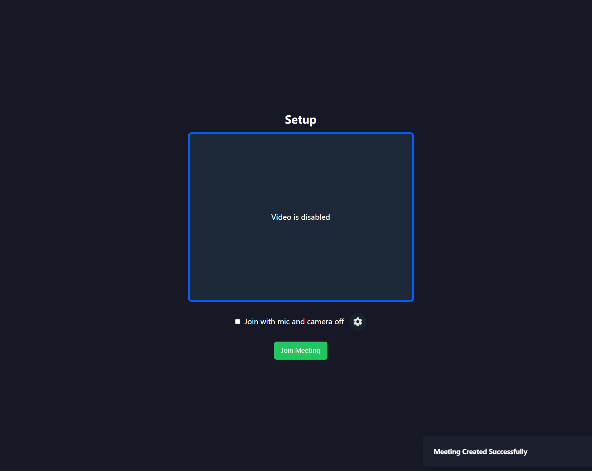

# zoom-ben Project
The project is a **Zoomlike WebApplication** for demostrate my ability as a 
$${\color{red}Front-End Developer}$$
$${\color{red}Full-Stack Developer}$$
this project can do almost every essential functionality that zoom can do, like online-video meeting webapp.
It is acheived by Next.js as the most important tool.
And the help with https://ui.shadcn.com/docs and Tailwind for the frontend design stuff.
And the third-party tool: 
**Clerk** for Login/out & Register => User management.
**Video Streaming** features => the actual Video Call and Stream Framework.

## Getting Started

This is a [Next.js](https://nextjs.org/) project bootstrapped with [`create-next-app`](https://github.com/vercel/next.js/tree/canary/packages/create-next-app).
First, run the development server:

```bash
npm run dev
# or
yarn dev
# or
pnpm dev
# or
bun dev
```

Open [http://localhost:3000](http://localhost:3000) with your browser to see the result.

You can start editing the page by modifying `app/page.tsx`. The page auto-updates as you edit the file.

This project uses [`next/font`](https://nextjs.org/docs/basic-features/font-optimization) to automatically optimize and load Inter, a custom Google Font.

## Learn More

To learn more about Next.js, take a look at the following resources:

- [Next.js Documentation](https://nextjs.org/docs) - learn about Next.js features and API.
- [Learn Next.js](https://nextjs.org/learn) - an interactive Next.js tutorial.

You can check out [the Next.js GitHub repository](https://github.com/vercel/next.js/) - your feedback and contributions are welcome!

## Deploy on Vercel

The easiest way to deploy your Next.js app is to use the [Vercel Platform](https://vercel.com/new?utm_medium=default-template&filter=next.js&utm_source=create-next-app&utm_campaign=create-next-app-readme) from the creators of Next.js.

Check out our [Next.js deployment documentation](https://nextjs.org/docs/deployment) for more details.

## Demo of the project

### Login/Signup page by the Clerk API provided function
you can login/signup with the Google/Github account
or just sign up with email and username. The Clerk provided the full API for login/out and signup
Official Document page for: https://clerk.com/docs/quickstarts/nextjs


### Home page after login

with 4 functions and sidebar to navigate to 4 different sites

### Upcoming site


### Previous site


### Recording site


### Personal Room


### Before the video set up



Video Streaming features achieved by Stream React Video SDK API from https://getstream.io/video/docs/react/

### After join the meeting


### Join the Meeting with invitation


### schedule the upcoming meeting
